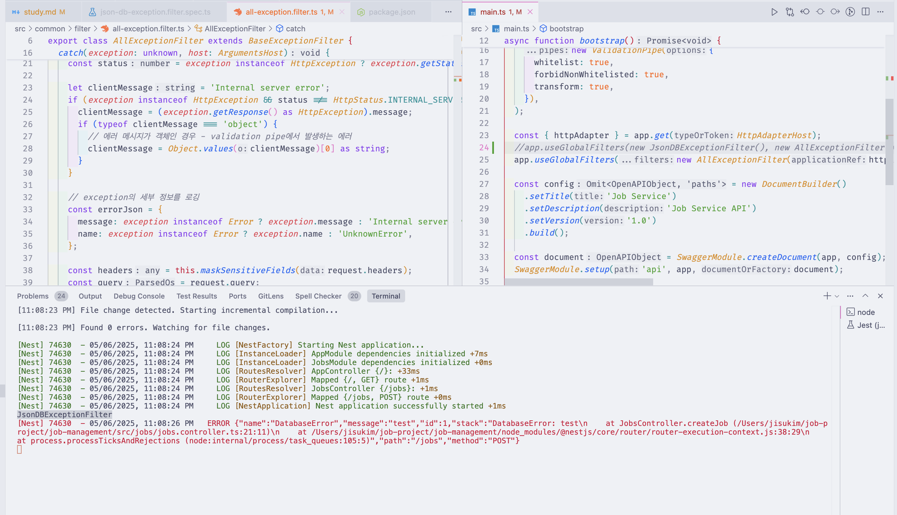
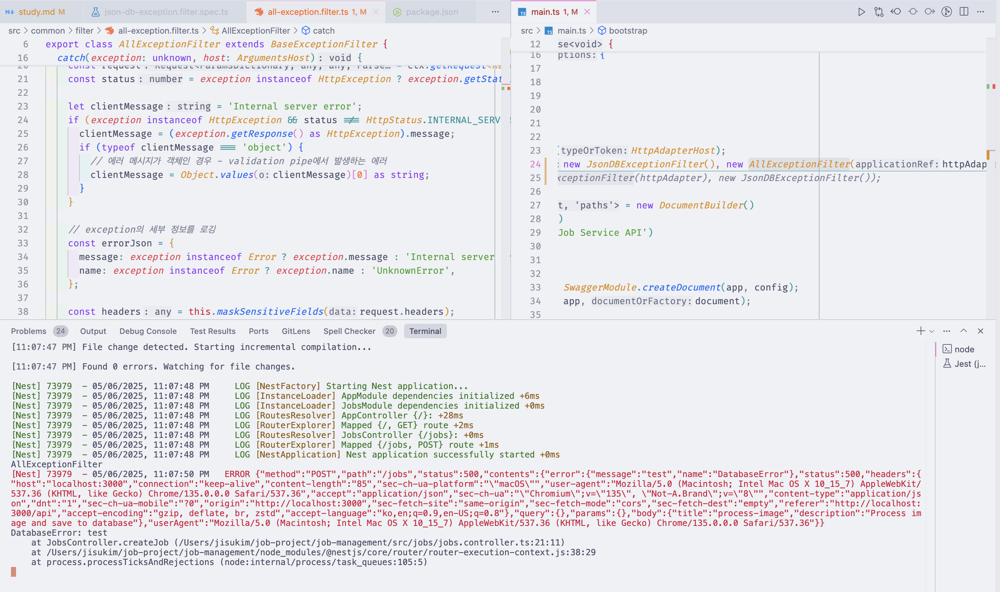
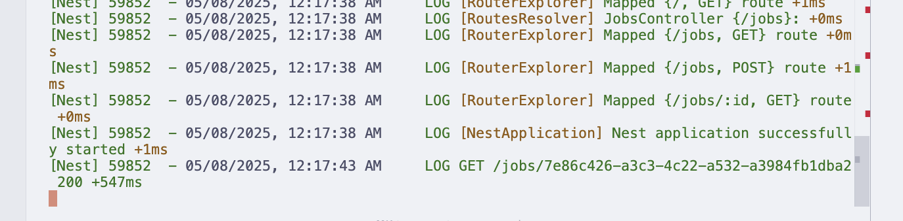
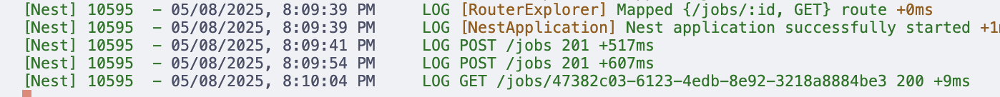
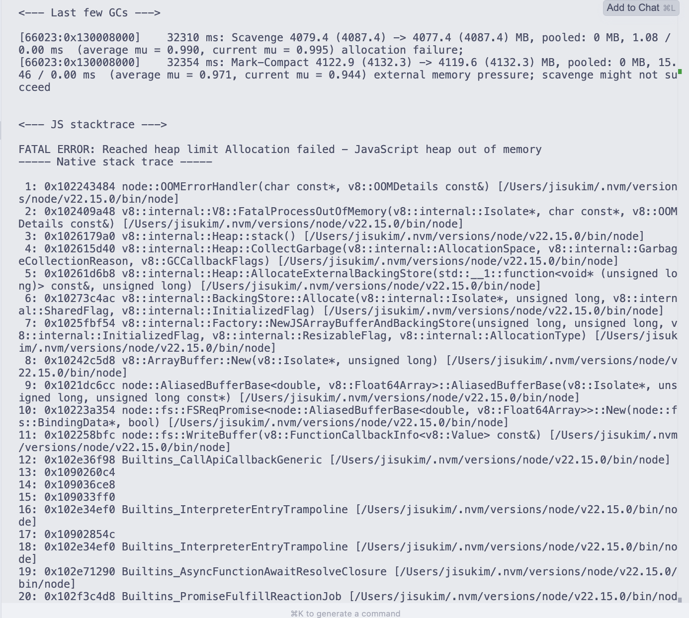
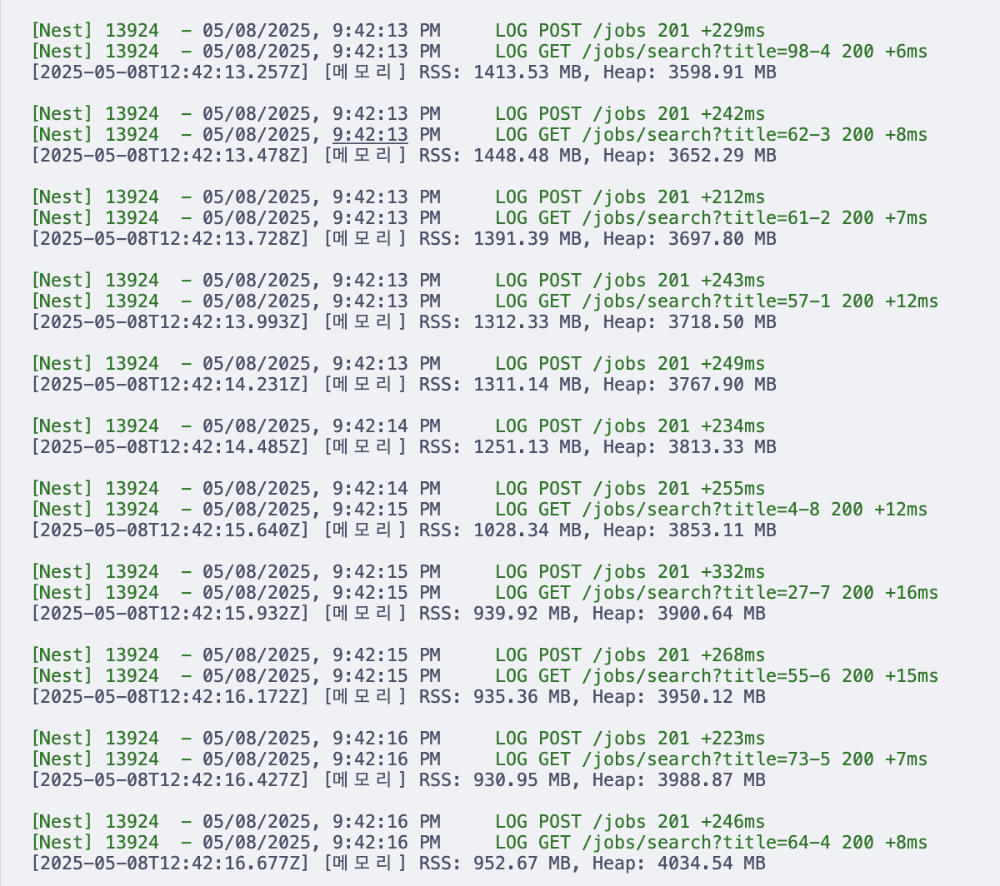

### package manager
- "기본 노드 환경에서 실행되게끔 세팅" 이라고 되어있었기 때문에 npm선택


### node-json-db
[https://www.npmjs.com/package/node-json-db](https://www.npmjs.com/package/node-json-db)

- JSON 파일을 이용한 데이터베이스
- DataPath로 데이터를 탐색할 수 있다. (XMLPath와 유사)


#### CRUD

```ts
{
    test: {
        data1 : {
            array : ['test','array']
        },
        data2 : 5
    }
}
```

- 배열 값 가져오기 : /test/data1/array
- 객체 값 가져오기 : /test/data2
- 전체 객체 가져오기 : /test
- 루트 : /

[참고-tests](https://github.com/Belphemur/node-json-db/tree/master/test)

- CRUD가 일어날 때 마다 파일 전체를 다시 쓴다.
- 따라서 데이터가 많아지면 성능이 떨어진다.

```ts
db.push(path, data);
```

- 기본적으로 기존 데이터 override
- DataPath가 없으면 계층 생성
- 객체를 직접 push 할 수 있음
- append 하고 싶을 경우
- 재귀적으로 동작하고 객체와 배열에 대해서도 동작함

```ts
// If you don't want to override the data but to merge them
// The merge is recursive and works with Object and Array.
await db.push("/test3", {
    new:"cool",
    json: {
        important : 5
    }
}, false); // false option

/*
This give you this results :
{
   "test":"test",
   "json":{
      "test":[
         "test"
      ],
      "important":5
   },
   "new":"cool"
}
```

- primitive타입에서는 불가능 (그냥 override)

```ts
db.getData(path);
```

- 데이터 가져오기
- path가 유효하지 않으면 Error.

```ts
db.getObjectDefault<T>(path, defaultValue: T);
```

- path가 유효하지 않으면 defaultValue 반환하는 getObjectDefault method

```ts
db.save();
```

- saveOnPush false일 경우 매번 호출해서 실제 디스크에 작성해야 함

```ts
db.delete(path);
```

- 데이터 삭제

```ts
db.reload();
```

- 외부 파일 변경사항으로 리로드가 필요할 경우 사용

#### Array

- array index로 접근 가능

```ts
// This will create an array 'myarray' with the object '{obj:'test'}' at index 0
await db.push("/arraytest/myarray[0]", {
    obj:'test'
}, true);

// You can retrieve a property of an object included in an array
// testString = 'test';
var testString = await db.getData("/arraytest/myarray[0]/obj");
```
- 배열 element삭제해도 배열 자체가 사라지진 않음.


- 추가 시 [] 사용

```ts
// You can also easily append a new item to an existing array
// This sets the next index with {obj: 'test'}
await db.push("/arraytest/myarray[]", {
    obj:'test'
}, true);


// 이건 { myTest: 'test' } 형식의 객체로 append됨.
await db.push("/arraytest/myarray[]/myTest", 'test', true);
```
- lastItem에는 음수로 접근할 수 있음 (파이썬같이)
- db.count() 로 배열 길이 확인할 수 있음


```ts
// You can have the current index of an object
await db.push("/arraytest/myarray", [{id: 65464646155, name: "test"}], true);
await db.getIndex("/arraytest/myarray", 65464646155);
// The default property is 'id'
// You can add another property instead
await db.getIndex("/arraytest/myarray", "test", "name");

// It's useful if you want to delete an object
await db.delete("/arraytest/myarray[" + await db.getIndex("/arraytest/myarray", 65464646155) + "]");
```
- id 기준으로 index를 반환하는 getIndex.
- 다른 프로퍼티를 찾아 반환할 수 있음.


more: [JsonDB.ts](https://github.com/Belphemur/node-json-db/blob/c38a9e73c98599c7404ac6858e5ad1cba60a37ef/src/JsonDB.ts#L403)


#### filter

```ts
db.filter(path, callback);
```

- 콜백 함수를 이용해 필터링

#### Error

DataError (데이터 관련 에러)
| 에러 메시지 | 발생 상황 |
|-------------|-----------|
| The Data Path can't be empty | 데이터 경로(DataPath)가 비어 있을 때. (최소한 루트 구분자 /는 있어야 함) |
| Can't find dataPath: /XXX. Stopped at YYY | 지정한 DataPath의 전체 계층이 DB에 존재하지 않을 때. (getData, delete 등에서 경로가 없을 때) |
| Can't merge another type of data with an Array | 현재 데이터가 배열이 아닌데, 배열 데이터를 병합(push)하려고 할 때. |
| Can't merge an Array with an Object | 현재 데이터가 배열인데, 객체 데이터를 병합(push)하려고 할 때. |
| DataPath: /XXX. YYY is not an array. | 배열이어야 할 경로에 배열이 아닌 데이터가 있을 때. |
| DataPath: /XXX. Can't find index INDEX in array YYY | 배열에서 존재하지 않는 인덱스에 접근하려고 할 때. |
| Only numerical values accepted for array index | 배열 인덱스에 숫자가 아닌 값을 사용하려고 할 때. |
| The entry at the path (/XXX) needs to be either an Object or an Array | find 메서드 사용 시, rootPath가 객체나 배열이 아닐 때. |


DatabaseError (DB 파일 관련 에러)
| 에러 메시지 | 발생 상황 |
|-------------|-----------|
| Can't Load Database: XXXX | DB 파일을 불러오는 데 실패했을 때. (내부 에러는 error.inner에 있음) |
| Can't save the database: XXX | DB 파일 저장에 실패했을 때. (내부 에러는 error.inner에 있음) |
| DataBase not loaded. Can't write | DB가 제대로 로드되지 않아, 데이터 저장을 막을 때. (기존 DB 손상 방지 목적) |


### Exception filter 실행 순서
- `useGlobalFilters`에 필터 두 개를 등록
- 필터 두 개를 등록한 경우 뒤에서부터 실행

원하는 것 : `DataBaseError`, `DataError` 발생 시 `JsonDBExceptionFilter` 실행

1. AllExceptionFilter, JsonDBExceptionFilter 순으로 등록했을 때

```ts
app.useGlobalFilters(new AllExceptionFilter(httpAdapter), new JsonDBExceptionFilter());
```
- JsonDBExceptionFilter 실행




2. JsonDBExceptionFilter, AllExceptionFilter 순으로 등록했을 때

```ts
app.useGlobalFilters(new JsonDBExceptionFilter(), new AllExceptionFilter(httpAdapter));
```

- AllExceptionFilter 실행




### select를 빠르게

- node-json-db에서는 `getData`가 처음 이루어질 때 `load()`를 명시적으로 호출함
- 이걸 repository의 constructor에서 호출해서 GET API가 처음 호출될 때의 API 지연을 방지

#### Before, 100000개 레코드 중 특정 id select

```bash
[Nest] 59852  - 05/08/2025, 12:17:43 AM     LOG GET /jobs/7e86c426-a3c3-4c22-a532-a3984fb1dba2 200 +547ms
```


#### After

```bash
[Nest] 61043  - 05/08/2025, 12:18:32 AM     LOG GET /jobs/7e86c426-a3c3-4c22-a532-a3984fb1dba2 200 +12ms
```



### insert를 빠르게 (update를 빠르게)
- push / save를 나눠서 하는 전략
- 100000 개 레코드에 job append

#### Before



- save on push option true
- 500~600ms

#### After


- push 후 save는 await 안하고 비동기처리
- 250~300ms
- 시간 50% 감소


#### OOM을 겪다..



- k6로 부하테스트 하다가 발생
- 메모리 증가량이 POST 하나마다 파일 용량만큼 증가

- 터지는 순간 logs.json 파일이 사라짐


#### 이유 - fs.open(path, flags, mode)

- 'w': Open file for writing. The file is created (if it does not exist) or truncated (if it exists).
- 파일 쓰기 모드는 기본적으로 truncated 되므로 문제가 생겼을 때 파일이 날아가버린다..
