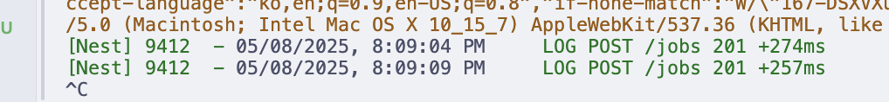

### package manager
- "기본 노드 환경에서 실행되게끔 세팅" 이라고 되어있었기 때문에 npm선택


### node-json-db
[https://www.npmjs.com/package/node-json-db](https://www.npmjs.com/package/node-json-db)

- JSON 파일을 이용한 데이터베이스
- DataPath로 데이터를 탐색할 수 있다. (XMLPath와 유사)


#### CRUD

```ts
{
    test: {
        data1 : {
            array : ['test','array']
        },
        data2 : 5
    }
}
```

- 배열 값 가져오기 : /test/data1/array
- 객체 값 가져오기 : /test/data2
- 전체 객체 가져오기 : /test
- 루트 : /

[참고-tests](https://github.com/Belphemur/node-json-db/tree/master/test)

- CRUD가 일어날 때 마다 파일 전체를 다시 쓴다.
- 따라서 데이터가 많아지면 성능이 떨어진다.

```ts
db.push(path, data);
```

- 기본적으로 기존 데이터 override
- DataPath가 없으면 계층 생성
- 객체를 직접 push 할 수 있음
- append 하고 싶을 경우
- 재귀적으로 동작하고 객체와 배열에 대해서도 동작함

```ts
// If you don't want to override the data but to merge them
// The merge is recursive and works with Object and Array.
await db.push("/test3", {
    new:"cool",
    json: {
        important : 5
    }
}, false); // false option

/*
This give you this results :
{
   "test":"test",
   "json":{
      "test":[
         "test"
      ],
      "important":5
   },
   "new":"cool"
}
```

- primitive타입에서는 불가능 (그냥 override)

```ts
db.getData(path);
```

- 데이터 가져오기
- path가 유효하지 않으면 Error.

```ts
db.getObjectDefault<T>(path, defaultValue: T);
```

- path가 유효하지 않으면 defaultValue 반환하는 getObjectDefault method

```ts
db.save();
```

- saveOnPush false일 경우 매번 호출해서 실제 디스크에 작성해야 함

```ts
db.delete(path);
```

- 데이터 삭제

```ts
db.reload();
```

- 외부 파일 변경사항으로 리로드가 필요할 경우 사용

#### Array

- array index로 접근 가능

```ts
// This will create an array 'myarray' with the object '{obj:'test'}' at index 0
await db.push("/arraytest/myarray[0]", {
    obj:'test'
}, true);

// You can retrieve a property of an object included in an array
// testString = 'test';
var testString = await db.getData("/arraytest/myarray[0]/obj");
```
- 배열 element삭제해도 배열 자체가 사라지진 않음.


- 추가 시 [] 사용

```ts
// You can also easily append a new item to an existing array
// This sets the next index with {obj: 'test'}
await db.push("/arraytest/myarray[]", {
    obj:'test'
}, true);


// 이건 { myTest: 'test' } 형식의 객체로 append됨.
await db.push("/arraytest/myarray[]/myTest", 'test', true);
```
- lastItem에는 음수로 접근할 수 있음 (파이썬같이)
- db.count() 로 배열 길이 확인할 수 있음


```ts
// You can have the current index of an object
await db.push("/arraytest/myarray", [{id: 65464646155, name: "test"}], true);
await db.getIndex("/arraytest/myarray", 65464646155);
// The default property is 'id'
// You can add another property instead
await db.getIndex("/arraytest/myarray", "test", "name");

// It's useful if you want to delete an object
await db.delete("/arraytest/myarray[" + await db.getIndex("/arraytest/myarray", 65464646155) + "]");
```
- id 기준으로 index를 반환하는 getIndex.
- 다른 프로퍼티를 찾아 반환할 수 있음.


more: [JsonDB.ts](https://github.com/Belphemur/node-json-db/blob/c38a9e73c98599c7404ac6858e5ad1cba60a37ef/src/JsonDB.ts#L403)


#### filter

```ts
db.filter(path, callback);
```

- 콜백 함수를 이용해 필터링

#### Error

DataError (데이터 관련 에러)
| 에러 메시지 | 발생 상황 |
|-------------|-----------|
| The Data Path can't be empty | 데이터 경로(DataPath)가 비어 있을 때. (최소한 루트 구분자 /는 있어야 함) |
| Can't find dataPath: /XXX. Stopped at YYY | 지정한 DataPath의 전체 계층이 DB에 존재하지 않을 때. (getData, delete 등에서 경로가 없을 때) |
| Can't merge another type of data with an Array | 현재 데이터가 배열이 아닌데, 배열 데이터를 병합(push)하려고 할 때. |
| Can't merge an Array with an Object | 현재 데이터가 배열인데, 객체 데이터를 병합(push)하려고 할 때. |
| DataPath: /XXX. YYY is not an array. | 배열이어야 할 경로에 배열이 아닌 데이터가 있을 때. |
| DataPath: /XXX. Can't find index INDEX in array YYY | 배열에서 존재하지 않는 인덱스에 접근하려고 할 때. |
| Only numerical values accepted for array index | 배열 인덱스에 숫자가 아닌 값을 사용하려고 할 때. |
| The entry at the path (/XXX) needs to be either an Object or an Array | find 메서드 사용 시, rootPath가 객체나 배열이 아닐 때. |


DatabaseError (DB 파일 관련 에러)
| 에러 메시지 | 발생 상황 |
|-------------|-----------|
| Can't Load Database: XXXX | DB 파일을 불러오는 데 실패했을 때. (내부 에러는 error.inner에 있음) |
| Can't save the database: XXX | DB 파일 저장에 실패했을 때. (내부 에러는 error.inner에 있음) |
| DataBase not loaded. Can't write | DB가 제대로 로드되지 않아, 데이터 저장을 막을 때. (기존 DB 손상 방지 목적) |


### Exception filter 실행 순서
- `useGlobalFilters`에 필터 두 개를 등록
- 필터 두 개를 등록한 경우 뒤에서부터 실행

원하는 것 : `DataBaseError`, `DataError` 발생 시 `JsonDBExceptionFilter` 실행

1. AllExceptionFilter, JsonDBExceptionFilter 순으로 등록했을 때

```ts
app.useGlobalFilters(new AllExceptionFilter(httpAdapter), new JsonDBExceptionFilter());
```
- JsonDBExceptionFilter 실행


2. JsonDBExceptionFilter, AllExceptionFilter 순으로 등록했을 때

```ts
app.useGlobalFilters(new JsonDBExceptionFilter(), new AllExceptionFilter(httpAdapter));
```

- AllExceptionFilter 실행


### select를 빠르게

- node-json-db에서는 `getData`가 처음 이루어질 때 `load()`를 명시적으로 호출함
- 이걸 repository의 constructor에서 호출해서 GET API가 처음 호출될 때의 API 지연을 방지

#### Before, 100000개 레코드 중 특정 id select

```bash
[Nest] 59852  - 05/08/2025, 12:17:43 AM     LOG GET /jobs/7e86c426-a3c3-4c22-a532-a3984fb1dba2 200 +547ms
```


#### After

```bash
[Nest] 61043  - 05/08/2025, 12:18:32 AM     LOG GET /jobs/7e86c426-a3c3-4c22-a532-a3984fb1dba2 200 +12ms
```


### insert를 빠르게 (update를 빠르게)

- 처음엔 push/save를 나눠서 push만 await 처리, save는 await 하지 않고 비동기 처리.
- 라이브러리 코드를 살펴보니 동시성 테스트가 있어서, push와 save 모두 비동기처리 하는 방법 고안.

- k6 부하테스트로 (test/jobs-stress-test.js) 실험

(공통 조건)
- 10000개의 베이스 레코드, 10개의 가상유저가 0.01초 간격으로 10초동안 요청
- 1. POST,  2. POST한 job의 title으로 GET(search) 요청


#### 1. push / save를 나눠서 하는 전략
- 100000 개 레코드에 job 하나 append

##### Before


- save on push option true
- 500~600ms

##### After



- push 후 save는 await 안하고 비동기처리
- 250~300ms
- 시간 50% 감소

##### k6로 올바른 data가 오는지, save를 나중에 처리해도 get job하는 데엔 문제 없는지 확인
- post -> search?title= 으로 확인.

```bash
 █ TOTAL RESULTS

    CUSTOM
    get_duration............................................................: avg=130.488125 min=3.21     med=114.614  max=504.247  p(90)=247.5044 p(95)=287.6748
    post_duration...........................................................: avg=150.592939 min=22.841   med=139.83   max=494.806  p(90)=254.1046 p(95)=287.163

    HTTP
    http_req_duration.......................................................: avg=140.54ms   min=3.21ms   med=129.11ms max=504.24ms p(90)=251.76ms p(95)=287.58ms
      { expected_response:true }............................................: avg=140.54ms   min=3.21ms   med=129.11ms max=504.24ms p(90)=251.76ms p(95)=287.58ms
    http_req_failed.........................................................: 0.00%  0 out of 1570
    http_reqs...............................................................: 1570   52.316409/s

    EXECUTION
    iteration_duration......................................................: avg=382.2ms    min=148.86ms med=381.19ms max=675.9ms  p(90)=481.03ms p(95)=590.11ms
    iterations..............................................................: 785    26.158204/s
    vus.....................................................................: 10     min=10        max=10
    vus_max.................................................................: 10     min=10        max=10

    NETWORK
    data_received...........................................................: 681 kB 23 kB/s
    data_sent...............................................................: 234 kB 7.8 kB/s
```

- 10000개 레코드에 push, 실패율 0%로 성공적.
- POST 의 p95 287ms.
- GET 의 p95 287ms.


#### 2. push도 비동기로 처리

- node-json-db에서 push / getData에 동시성 문제가 발생하지 않음을 보장함.
- push하고 getData를 바로 해도 data를 가져올 수 있음.

[https://github.com/Belphemur/node-json-db/blob/master/test/06-concurrency.test.ts](https://github.com/Belphemur/node-json-db/blob/master/test/06-concurrency.test.ts)

```ts
describe('Multi getData', () => {
    test('should be blocking and wait for push to finish', async () => {
        const db = new JsonDB(new Config('test-concurrent-read'));
        let counter = 1;
        let record = {
            strval: `value ${counter}`,
            intval: counter
        };
        //We don't await the promise directly, to trigger a concurrent case
        const pushPromise = db.push(`/test/key${counter}`, record, false);
        const data = await db.getData("/test")

        await pushPromise;

        expect(data).toHaveProperty(`key${counter}`)
        expect(data[`key${counter}`]).toEqual(record);
    });
});
```

- service 코드 변경

```ts
async createJob(createJobDto: CreateJobDto) {
    const job = Job.fromDto(createJobDto);
    this.jobsRepository.push(job);
    return job;
}
```

```bash

  █ TOTAL RESULTS

    CUSTOM
    get_duration............................................................: avg=118.299269 min=2.266    med=107.427  max=396.768  p(90)=229.0826 p(95)=253.1403
    post_duration...........................................................: avg=140.54789  min=21.591   med=134.37   max=477.422  p(90)=236.5036 p(95)=262.8043

    HTTP
    http_req_duration.......................................................: avg=129.42ms   min=2.26ms   med=121.87ms max=477.42ms p(90)=232.72ms p(95)=257.04ms
      { expected_response:true }............................................: avg=129.42ms   min=2.26ms   med=121.87ms max=477.42ms p(90)=232.72ms p(95)=257.04ms
    http_req_failed.........................................................: 0.00%  0 out of 1678
    http_reqs...............................................................: 1678   55.593614/s

    EXECUTION
    iteration_duration......................................................: avg=359.68ms   min=146.74ms med=363.33ms max=771.2ms  p(90)=447.65ms p(95)=482.36ms
    iterations..............................................................: 839    27.796807/s
    vus.....................................................................: 10     min=10        max=10
    vus_max.................................................................: 10     min=10        max=10

    NETWORK
    data_received...........................................................: 727 kB 24 kB/s
    data_sent...............................................................: 250 kB 8.3 kB/s

```

- POST 의 p95 262ms.
- GET 의 p95 257ms.

- 성공률은 100%.
- 평균 응답시간, p95, max 모두 줄어들었음.

- 하지만 push가 실패했을 경우에도 무조건 success 응답이 가는 등 데이터 무결성을 보장할 수 없음. (기각)
- save의 실패는 어떻게 처리하지

#### OOM을 겪다..


- k6로 부하테스트 하다가 발생
- 메모리 증가량이 POST 하나마다 파일 용량만큼 증가


- 원래 하려던 POST 후 GET 했을 때 요구사항이 잘 반영되냐? 는 ok

- 터지는 순간 logs.json 파일이 사라짐


##### 이유 - fs.open(path, flags, mode)

- 'w': Open file for writing. The file is created (if it does not exist) or truncated (if it exists).
- 파일 쓰기 모드는 기본적으로 truncated 되므로 문제가 생겼을 때 파일이 날아가버린다..


### @Cron과 @Interval의 차이

- @Cron은 특정 시간에 실행
- @Interval은 일정 간격으로 실행
  - 서버가 up된 순간부터 setInterval이 실행된다.

- @Cron은 초단위, @Interval은 밀리초단위


### select + 특정 id를 빠르게

- node-json-db에서 제공하는 getIndex

```ts
/**
 * Returns the index of the object that meets the criteria submitted. Returns -1, if no match is found.
 * @param dataPath  base dataPath from where to start searching
 * @param searchValue value to look for in the dataPath
 * @param propertyName name of the property to look for searchValue
 * @returns {Promise<number>}
 */
public async getIndex(
    dataPath: string,
    searchValue: string | number,
    propertyName: string = 'id'
): Promise<number> {
    const data = await this.getArrayData(dataPath)
    return data
        .map(function (element: any) {
            return element[propertyName]
        })
        .indexOf(searchValue)
}
```

- 참고 : [node-json-db/JsonDB.ts](https://github.com/Belphemur/node-json-db/blob/master/src/JsonDB.ts#L403)


- array data를 map으로 돎녀서 index를 찾으므로 찾는 시간이 배열의 길이에 비례함 (O(n))
- 따라서 배열의 길이가 길어질수록 찾는 시간이 오래 걸림

#### 개선안 - index hash map 사용
- js에서 제공하는 collection의 Map을 사용하여 조회를 O(1)로 만들 수 있음
- `Map<id: string, index: number>` 형식의 hash map을 만들어서 조회


### Lock?
- Redis같은 외부 시스템을 활용한 분산 락을 걸 수 있음.
- 멀티 프로세스나 스레드 환경에서는 필요함.
